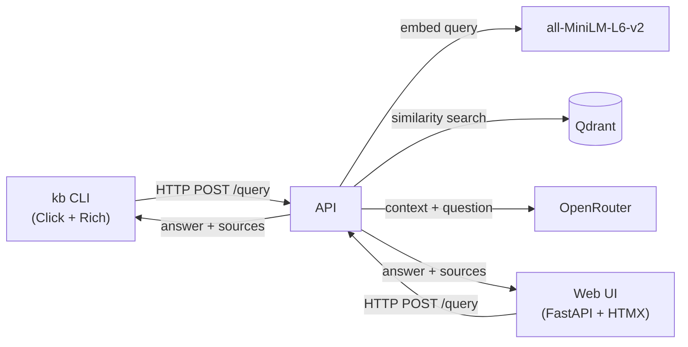

# Case Study: kb — MLOps & Platform CLI

**Executive Summary:** *kb* (published as [`karabo-ml`](https://pypi.org/project/karabo-ml/)) is a production-grade CLI and Web UI that brings Retrieval-Augmented Generation (RAG) to DevOps documentation. With a single `pip install` and one command, platform engineers can query Kubernetes, Docker, and infrastructure docs using natural language — backed by a FastAPI + Qdrant + OpenRouter pipeline deployed on Docker Compose and k3s.

---

## 1. Problem Statement

Platform engineers spend a disproportionate amount of time searching fragmented documentation — K8s docs, Dockerfile references, Terraform providers, monitoring guides, and internal runbooks. A typical workflow involves "How do I configure Prometheus persistent storage in k3s?" followed by 5–10 minutes of tab-switching across browser windows, StackOverflow threads, and official docs.

The core question was: **Can we reduce that lookup time from minutes to seconds with a CLI-first RAG assistant?**

Existing solutions were either:
- **GUI-only** (ChatGPT, Perplexity) — not pipeable into a terminal workflow.
- **Vendor-locked** (Copilot for Docs) — tied to specific ecosystems.
- **Too heavy** (LangChain + local LLM stacks) — high compute overhead for a simple Q&A task.

The goal was to build a lightweight, CLI-native, deployable assistant that fits into the existing toolchain of a platform engineer.

---

## 2. Architecture Overview

The system has five layers:

| Layer | Technology | Role |
|---|---|---|
| **CLI** | Python + Click + Rich | Terminal entry point; `kb rag query`, `kb drift check`, `kb cluster status`, etc. |
| **Web UI** | FastAPI + HTMX + Jinja2 | Browser-based chat interface; zero JS build step |
| **RAG API** | FastAPI (standalone backend) | Embeds queries, searches Qdrant, calls OpenRouter |
| **Vector Store** | Qdrant | Stores 384-dim embeddings of DevOps documentation chunks |
| **LLM** | OpenRouter (GPT-4o-mini) | Generates answers with source citations from retrieved chunks |
| **Infrastructure** | Docker Compose / k3s / GHCR | Multi-stage Docker image (140 MB), k3s manifests for production deployment |

**Data flow:** User question → sentence-transformer embedding → Qdrant top-5 retrieval → context-augmented prompt → OpenRouter answer → rich terminal output or HTMX-rendered page.

---

## 3. Key Technical Decisions & Trade-offs

### Decision 1: Click + Rich over Typer / Textual
**Why:** Click is the de facto CLI framework in Python, battle-tested across thousands of projects. Rich provides beautiful terminal output (tables, panels, markdown) without the overhead of a full TUI framework like Textual. **Trade-off:** Textual would enable a richer interactive mode, but the `kb rag chat` REPL via Rich suffices for the 80% use case.

### Decision 2: HTMX frontend (no JS build)
**Why:** The Web UI is a thin chat interface — no complex interactivity. HTMX + Jinja2 server-side rendering eliminates npm, webpack, and bundle steps entirely. **Trade-off:** Not suitable for a highly interactive SPA, but for a query-and-display interface the DX win is enormous.

### Decision 3: OpenRouter over self-hosted LLM
**Why:** Self-hosting even a 7B-parameter model requires GPU memory. OpenRouter gives access to GPT-4o-mini (and fallback models) on a pay-per-token basis. **Trade-off:** Latency is higher than a local model, and there's a per-query cost — but the quality and zero-maintenance trade-off is worth it for a CLI tool.

### Decision 4: Qdrant over pgvector / Chroma
**Why:** Qdrant is purpose-built for vector search, supports filtering, and runs as a standalone container. It's more performant at scale than pgvector (which needs Postgres) and more production-ready than Chroma. **Trade-off:** An additional service to deploy — but Docker Compose makes it a one-command setup.

### Decision 5: Multi-stage Docker + non-root user
**Why:** Security best practice. The runtime image is 140 MB and runs as `kbuser` (non-root) with no shell or build tools. **Trade-off:** Slightly more complex Dockerfile, but critical for production k3s deployment.

---

## 4. Results & Metrics

| Metric | Value |
|---|---|
| **CLI commands** | 10+ (rag, model, drift, cluster, config, completions) |
| **Unit tests** | 35 (Click CLI tests, config, client, completions) |
| **Distribution** | PyPI (`pip install karabo-ml`) + GHCR (`docker pull ghcr.io/dynamickarabo/karabo-ml`) |
| **Deployment** | Docker Compose (dev) + k3s manifests (production VPS at `178.105.76.236`) |
| **Web UI** | Live at `https://kb.karabo.dev` — FastAPI + HTMX, dark theme |
| **Docker image** | 140 MB runtime, Python 3.11-slim, non-root user |
| **CI/CD** | GitHub Actions: lint → build → GHCR push → PyPI publish |

The project demonstrates full-stack MLOps delivery: a distributable CLI on PyPI, containerized on GHCR, orchestrated on k3s, with a live web frontend — all connected to a real RAG pipeline serving GPT-4o-mini answers with Qdrant vector search.

---

## 5. What I Learned

1. **CLI-first is underrated.** A well-designed CLI is the fastest path from "I have a question" to "here's the answer" for engineers who live in the terminal. The `kb rag query` pattern — one command, no context switching — is surprisingly powerful.

2. **HTMX is ready for production CRUD-like interfaces.** The Web UI took a single afternoon to build — no JS fatigue, no bundle config. For anything that's "form submission → HTML response," HTMX is the right tool.

3. **RAG pipelines benefit from simplicity.** Many RAG tutorials add chains, agents, memory, and tool-use. For DevOps Q&A, a straightforward embed-retrieve-generate loop with source citations is both simpler to debug and more reliable.

4. **Distribution matters for adoption.** Making the project `pip install`-able (PyPI) and `docker run`-able (GHCR) lowered the friction for others to try it. A project that isn't trivially installable is a project few will use.

5. **k3s manifests as documentation.** Writing k3s YAML alongside Docker Compose forced production thinking — health probes, resource limits, ConfigMaps — patterns that development-only setups often skip.

---

## 6. Links

| Resource | URL |
|---|---|
| **GitHub Repository** | [github.com/DynamicKarabo/karabo-ml](https://github.com/DynamicKarabo/karabo-ml) |
| **PyPI Package** | [pypi.org/project/karabo-ml](https://pypi.org/project/karabo-ml) |
| **Live Web UI** | [kb.karabo.dev](https://kb.karabo.dev) |
| **GHCR Image** | `ghcr.io/dynamickarabo/karabo-ml:latest` |

---

*Built by [Karabo Oliphant](https://github.com/DynamicKarabo) — Platform Engineer building the infrastructure that makes ML work in production.*
