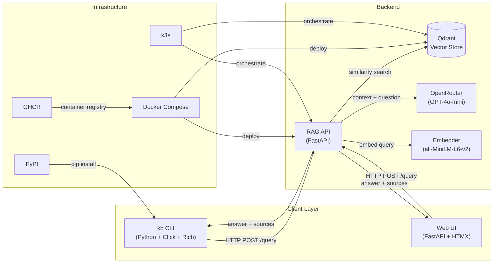

<p align="center">
  
  
  
  
  
</p>

<p align="center">
  <b>⚡ kb — MLOps & Platform CLI</b><br>
  Query DevOps docs, detect drift, manage clusters, serve models.<br>
  One command from question to production insight.
</p>

<p align="center">
  <a href="#-quick-start">Quick Start</a> •
  <a href="#-commands">Commands</a> •
  <a href="#-web-ui">Web UI</a> •
  <a href="#-architecture">Architecture</a> •
  <a href="#-why-this-exists">Why This Exists</a>
</p>

---

## 🔥 Quick Start

```bash
pip install karabo-ml
kb rag query "How do I set up ArgoCD in a k3s cluster?"
```

That's it. The CLI talks to your RAG API backend (Qdrant + OpenRouter) and returns answers with source citations.

### Docker

```bash
docker run --rm ghcr.io/dynamickarabo/karabo-ml kb --help
```

### Full stack (CLI + Web + Qdrant)

```bash
# Clone the RAG backend + bring up everything
git clone https://github.com/DynamicKarabo/rag-devops-assistant.git
cd rag-devops-assistant
docker compose up -d

# Now query from CLI or open http://localhost:8080
kb rag query "How to configure Prometheus persistent storage?"
```

---

## 📦 Commands

### `kb rag query` — Ask a DevOps question

```bash
kb rag query "How do I set up ArgoCD in a k3s cluster?"
kb rag query --top-k 10 --json "What is the best way to configure Prometheus?"
```

**Output:** Rich terminal UI with answer + source citations + token count + latency.


### `kb rag chat` — Interactive mode

```bash
kb rag chat
```

```
kb> How do I set up PersistentVolumeClaims in k3s?
╭──────────────────────────────────────────────╮
│ In k3s, PVCs work out of the box with        │
│ Local Path Provisioner as default...          │
│                                              │
│ [1] k3s Docs — https://docs.k3s.io/...       │
╰──────────────────────────────────────────────╯
270 tokens | openai/gpt-4o-mini | 1.2s
```

### `kb model serve` — Start the RAG API

```bash
kb model serve                 # docker-compose up -d
kb model serve --build         # rebuild + start
kb model serve --profile ingest  # include ingestion pipeline
kb model stop                  # tear down
```

### `kb drift check` — System health

```bash
kb drift check                 # API + Qdrant health dashboard
kb drift collections           # list Qdrant collections + point counts
```

```
                         System Health
┏━━━━━━━━━━━┳━━━━━━━━━━┳━━━━━━━━━━━━━━━━━━━━━━━━━━━━━━━━━┓
┃ Component ┃ Status   ┃ Details                         ┃
┡━━━━━━━━━━━╇━━━━━━━━━━╇━━━━━━━━━━━━━━━━━━━━━━━━━━━━━━━━━┩
│ RAG API   │ ✅ OK    │ 1,247 Qdrant points, 3 sources  │
│ Qdrant    │ ✅ OK    │ Collection: devops_docs (green)  │
└───────────┴──────────┴─────────────────────────────────┘
```

### `kb cluster status` — Cluster monitoring

```bash
kb cluster status              # Docker + k3s status
kb cluster status --all        # all running containers
kb cluster status --json       # JSON for piped output
kb cluster logs api            # tail API logs
kb cluster logs qdrant --tail 200
```

### `kb config` — Configuration

```bash
kb config init                 # create ~/.kb/config.yaml
kb config show                 # view effective config
kb config edit                 # open in $EDITOR
```

### `kb completions` — Shell completions

```bash
kb completions install bash    # adds to ~/.bashrc
kb completions install zsh     # adds to ~/.zshrc
kb completions fish            # print fish completions
```

---

## 🌐 Web UI

A dark-theme chat interface at **`http://localhost:8080`** (or [kb.karabo.dev](https://kb.karabo.dev) when deployed).

- FastAPI backend + HTMX frontend — no JS build step
- Same RAG backend as the CLI
- Clickable example questions
- Source citations with expandable snippets
- Token count, model, latency displayed per query


---

## 🏗 Architecture



### Data Flow

1. User asks "How to set up ArgoCD?" via CLI or Web
2. Query is embedded (384-dim vector via all-MiniLM-L6-v2)
3. Qdrant returns top-5 relevant documentation chunks
4. Chunks + question sent to OpenRouter (GPT-4o-mini)
5. LLM generates answer with [N] source citations
6. Response returned with latency, token count, model info

---

## 🛠 Tech Stack

| Layer | Choice | Why |
|-------|--------|-----|
| CLI Framework | **Click + Rich** | Industry standard + beautiful terminal output |
| HTTP Client | **httpx** | Async-capable, connection pooling |
| Config | **PyYAML + env vars** | 12-factor app pattern |
| Backend API | **FastAPI + Qdrant** | High-performance RAG pipeline |
| LLM | **OpenRouter** | Multi-provider, fallback, cost tracking |
| Embeddings | **sentence-transformers** | 80MB CPU-friendly, all-MiniLM-L6-v2 |
| Web UI | **FastAPI + HTMX + Jinja2** | Zero JS build, SSR, hypermedia-driven |
| Container | **Docker multi-stage** | 140MB runtime image, non-root user |
| Orchestration | **Docker Compose / k3s** | Dev → Prod parity |
| CI/CD | **GitHub Actions** | Lint → Build → GHCR Push → PyPI Publish |
| Distribution | **PyPI + GHCR** | pip install + docker pull |

---

## 📊 Why This Exists

I'm a Platform Engineer building infra that makes ML work in production. This project proves:

- **Full-stack MLOps delivery** — CLI, Web UI, RAG pipeline, containerization, orchestration
- **Production mindset** — observability, health checks, non-root containers, structured logging, config management
- **Distribution-ready** — packaged for PyPI, Docker Hub (GHCR), deployed on k3s
- **DevOps documentation RAG** — solves a real problem: finding Kubernetes/Docker/Terraform answers fast

**CV bullet:** "Designed and shipped a production-grade MLOps CLI + Web platform (karabo-ml) with 10+ commands, PyPI distribution, Docker deployment, and k3s orchestration — reducing internal DevOps documentation lookup time from minutes to seconds."

---

## 🚀 Quick Deploy (k3s)

```bash
# Deploy the Web UI to your k3s cluster
kubectl apply -f https://raw.githubusercontent.com/DynamicKarabo/karabo-ml/main/k3s/kb-web.yaml
kubectl apply -f https://raw.githubusercontent.com/DynamicKarabo/karabo-ml/main/k3s/kb-cli.yaml
```

---

## 💻 Development

```bash
pip install -e ".[dev]"
ruff check src/
ruff format src/
python -m build
```

---

## 📄 License

MIT — use it, ship it, put it on your CV.

---

<p align="center">
  <b>👷 Built by <a href="https://github.com/DynamicKarabo">Karabo Oliphant</a></b><br>
  <i>Platform Engineer — building the infrastructure that makes ML work in production</i>
</p>
